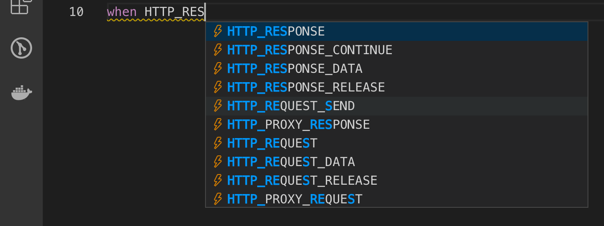
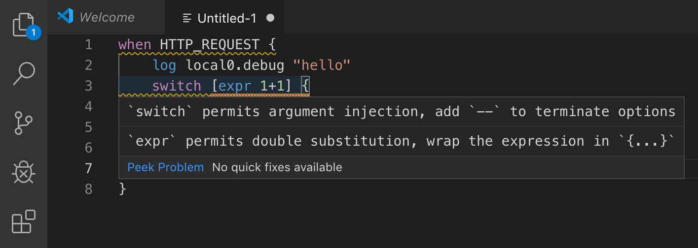

# F5 Networks iRule Extension

F5 Networks iRule extension for Visual Studio Code. This extension gives Tcl based iRule language support for Visual Studio Code including syntax and intelliSense support for iRule events, commands and statements, up to BIG-IP v16.0.

## Intellisense
This extension provides some code completion with Intellisense.


## Code Formatting
Code formatting is included. The code formatting at this point will attempt to correctly tab out an iRule, but will not split or join lines.


## Tcl Helpers
Added the "irule: Escape Selections to Tcl Quoted String" command to assist with pasting data into iRules.

## Diagnostics
Diagnostics will highlight some potential double-substitution issues, such as commands that work on expressions missing curly braces, commands that take options missing a `--`terminator, and `when` clauses missing priority.


## Installation
### From the marketplace
https://marketplace.visualstudio.com/items?itemName=bitwisecook.iRule

## Development
### Building the VSIX

```sh
make vsix
```
